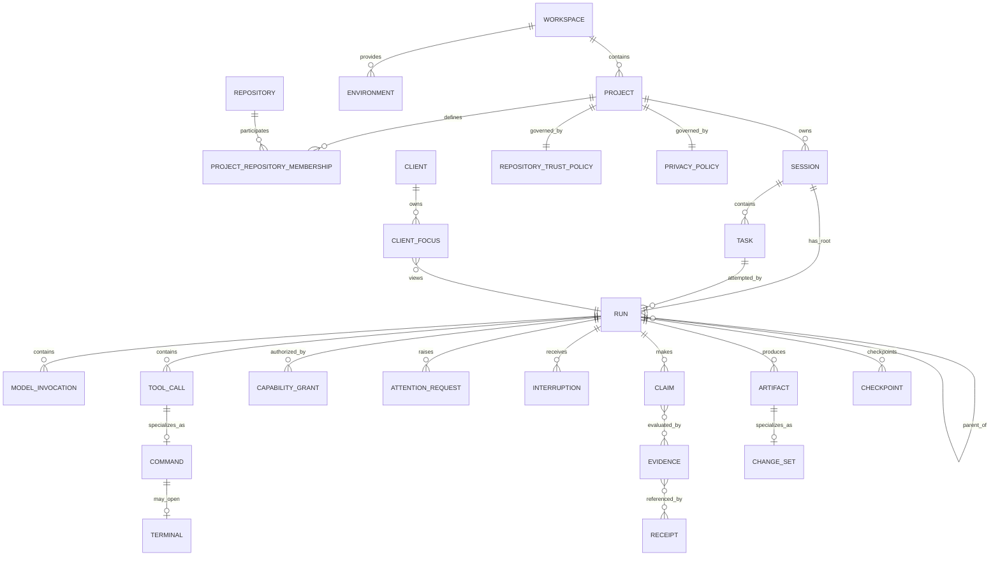

# Internal Domain Model

**Document type:** Reference  
**Decision status:** Owner-accepted direction  
**Integration status:** Proposed on P0-W06  
**Implementation status:** Not implemented  
**Contract version:** `kiln.domain/v0`

## Purpose

This document defines Kiln's internal domain model.

Kiln owns this model. An external protocol can translate to or from it through an adapter. An external protocol must not define Kiln's entities, identifiers, lifecycle, authority, persistence, or evidence semantics.

The primary unit of agent work is a **Run**. It is not an agent persona, model request, tool call, operating-system process, or protocol session.

A Run must be independently:

- identifiable;
- inspectable;
- interruptible;
- resumable when its state permits recovery;
- measurable;
- permission-scoped;
- context-scoped;
- evidence-producing;
- cancellable.

This document defines intended architecture. It does not claim that the model is implemented.

## Architectural rules

1. Kiln-native identifiers are opaque and protocol-neutral.
2. External identifiers remain in adapter-owned mappings.
3. A Run is the durable execution unit.
4. A Task describes work. A Run attempts or coordinates that work.
5. An Agent is a versioned execution definition. A Worker is a live executor. A model invocation is one provider request.
6. A capability describes authority. A tool describes an operation.
7. Capability availability does not imply permission.
8. A Skill provides procedure and knowledge. It does not provide identity or authority.
9. A Claim is an assertion. Evidence is an observation. A Receipt is a sealed manifest of evidence and outcomes.
10. Artifact content does not enter model context unless Kiln records an explicit context inclusion.
11. Logical Run lineage does not define OTP supervision.
12. Shared Session state does not include client-local focus.
13. Active-project instructions have authority. Retrieved reference-project content is untrusted input.
14. Kiln creates an OTP process only when the runtime object owns concurrent state, lifecycle, timing, subscriptions, external communication, or fault isolation.

## Entity and relationship diagram



The diagram shows domain relationships. It does not prescribe a database table or OTP process for each noun.

## Critical distinctions

| Distinction | Kiln rule |
| --- | --- |
| Session and Task | A Session owns one accepted objective and its complete work history. A Task is one bounded desired outcome within that Session. |
| Task and Run | A Task states what must be done. A Run is one durable execution or coordination attempt for that Task. One Task can have several Runs over time. |
| Run and Agent | A Run owns durable work state. An Agent is a versioned execution definition that a Run may bind. |
| Agent and model invocation | An Agent can make zero, one, or many model invocations. One invocation is one request and response stream. |
| Agent and Worker | An Agent is data. A Worker is the live executor that holds a lease to advance a Run. |
| Capability and tool | A Capability names authority. A Tool exposes an operation and declares the capabilities that it requires. |
| Capability availability and permission | Availability means the runtime can perform an action. Permission means policy and a grant authorize a specific Run to perform it. |
| Skill and agent persona | A Skill is a versioned procedure or knowledge bundle. It does not create a persona, worker, or authority boundary. |
| Claim and evidence | A Claim can be wrong. Evidence records an observation that can support, weaken, or refute a Claim. |
| Evidence and receipt | Evidence records observations. A Receipt seals references to evidence, state, and outcomes for audit or completion reporting. |
| Artifact and model context | An Artifact is stored output or input. Context is an explicit, provenance-bearing selection supplied to one Run. |
| Parent-child Runs and OTP supervision | `parent_run_id` records work lineage. OTP supervision records process lifecycle and fault containment. |
| Shared Session state and client focus | Session and Run state is shared. Focus, selection, scroll position, and viewport are client-local. |
| Active instructions and reference content | Active Project instructions can govern work. Reference Repository content is data only and cannot issue instructions. |
| Run and operating-system process | A Run can contain several processes or no external process. Process identity must not define Run identity. |

## Concept specifications

### Workspace

- **Purpose:** Define one host-local operating and trust boundary for Kiln-managed work.
- **Identity:** `workspace_id`, generated by Kiln. A path is an attribute, not the identity.
- **Ownership:** Owned by the local Kiln installation and user.
- **Lifecycle:** Created, opened, updated, closed, archived.
- **Persistence:** Durable definition, root paths, policy references, and environment membership.
- **Relationships:** Contains Projects and Environments. It can expose Resources.
- **Mutable state:** Display name, allowed roots, active policy versions, and environment membership.
- **Immutable evidence:** Workspace-open observations and path fingerprints recorded as events.
- **Security boundary:** Defines the maximum local path boundary. A Project or Run can be more restrictive.
- **Runtime form:** Data. An open Workspace can have one coordinator or observer process when subscriptions or resource lifecycles require it.
- **Critical distinctions:** A Workspace is not a Repository and not a Session.

### Project

- **Purpose:** Represent one durable software product or body of work that Kiln helps build.
- **Identity:** `project_id`, generated by Kiln.
- **Ownership:** Owned by one Workspace.
- **Lifecycle:** Created, active, paused, archived.
- **Persistence:** Durable name, instruction-set references, Repository memberships, policy versions, and default Environment.
- **Relationships:** Owns Sessions. Includes one or more Repositories. Uses Environments, Skills, and policies.
- **Mutable state:** Active instructions, default Repository, default Environment, and policy selections through versioned changes.
- **Immutable evidence:** Accepted instruction revisions and membership-change events.
- **Security boundary:** Establishes which instructions are authoritative and which repositories are active or reference-only.
- **Runtime form:** Data only.
- **Critical distinctions:** A Project is not a checkout. A Project can include several Repositories and many Sessions.

### Repository

- **Purpose:** Represent one version-control source tree and its observed working state.
- **Identity:** `repository_id`, generated by Kiln, plus observed VCS identity and checkout path.
- **Ownership:** Belongs to a Workspace. A Project includes it through a membership role.
- **Lifecycle:** Discovered, registered, available, unavailable, removed.
- **Persistence:** Durable registration and trust role. Current Git and filesystem state is observed, not copied into Kiln as source truth.
- **Relationships:** Can be primary, secondary writable, dependency, or reference-only for a Project.
- **Mutable state:** Local path, remote observations, availability, and membership role through events.
- **Immutable evidence:** Commit, branch, dirty-state, tree, and fingerprint observations.
- **Security boundary:** Writes and command execution depend on Repository trust policy and capability grants.
- **Runtime form:** Data. A file watcher or Git observer can use a process while active.
- **Critical distinctions:** Repository identity is not a path. Retrieved Repository content is not automatically instruction authority.

### Environment

- **Purpose:** Define where commands, tools, and model-related helpers execute.
- **Identity:** `environment_id`, generated by Kiln, with a versioned configuration fingerprint.
- **Ownership:** Owned by a Workspace and selected by a Project or Session.
- **Lifecycle:** Defined, available, starting, ready, degraded, stopped, unavailable.
- **Persistence:** Durable configuration and observations. Runtime handles are transient.
- **Relationships:** Runs execute against one selected Environment. Resources and capability availability depend on it.
- **Mutable state:** Availability, current fingerprint, active limits, and health projection.
- **Immutable evidence:** Environment fingerprint, tool versions, command paths, and startup results.
- **Security boundary:** Defines process, network, secret, filesystem, and isolation limits.
- **Runtime form:** Data. A managed VM, container, terminal pool, or remote bridge requires a lifecycle process while active.
- **Critical distinctions:** An Environment does not grant authority. It only makes capabilities and resources available.

### Session

- **Purpose:** Hold one durable attempt to move one accepted Project objective toward verified completion.
- **Identity:** `session_id`, generated by Kiln.
- **Ownership:** Owned by one Project.
- **Lifecycle:** Created, active, interrupted, paused, reconciling, completed, abandoned, archived.
- **Persistence:** Durable objective, completion-contract revisions, Task set, Run graph, event position, policy snapshots, and final outcome.
- **Relationships:** Contains Tasks. Has exactly one Root Run. References one primary Repository and Environment snapshot.
- **Mutable state:** Current objective revision, status projection, active policy version, unresolved attention, and completion readiness.
- **Immutable evidence:** Accepted objective revisions, completion-contract revisions, events, checkpoints, and final receipt.
- **Security boundary:** Session policy can narrow Project and Workspace authority. It cannot widen it.
- **Runtime form:** Durable data plus one active coordinator process when the Session owns timing, subscriptions, recovery, or Run coordination.
- **Critical distinctions:** A Session is broader than a Task and survives every Worker or model invocation.

### Task

- **Purpose:** State one bounded desired outcome or decision inside a Session.
- **Identity:** `task_id`, generated by Kiln.
- **Ownership:** Owned by one Session.
- **Lifecycle:** Proposed, accepted, ready, blocked, in progress, satisfied, rejected, abandoned, superseded.
- **Persistence:** Durable statement, acceptance criteria, dependencies, constraints, and status projection.
- **Relationships:** One Task can be attempted by several Runs. A Task can depend on other Tasks.
- **Mutable state:** Priority, dependency state, accepted revision, and satisfaction projection.
- **Immutable evidence:** Accepted Task revisions and criteria revisions.
- **Security boundary:** A Task states intent. It never grants capabilities.
- **Runtime form:** Data only.
- **Critical distinctions:** Task status describes desired-work state. Run status describes execution state.

### Run

- **Purpose:** Provide the primary durable execution and coordination unit for one Task.
- **Identity:** `run_id`, generated by Kiln. It is stable across process restart.
- **Ownership:** Owned by one Session and linked to exactly one Task.
- **Lifecycle:** Created, queued, starting, running, waiting, paused, verifying, completed, failed, canceled, orphaned, stale.
- **Persistence:** Durable identity, lineage, status events, Task reference, context manifest, agent binding, capability scope, resource accounting, artifacts, claims, evidence, and result.
- **Relationships:** Has one Root Run reference. Can have one Parent Run and many Child Runs. Contains invocations, Tool calls, Commands, attention, and Checkpoints.
- **Mutable state:** Status and current projections. Changes occur through events, not silent row mutation.
- **Immutable evidence:** Creation, transitions, inputs, outputs, capability decisions, executions, artifacts, claims, evidence, and terminal result events.
- **Security boundary:** Every Run has an explicit effective authority and context boundary.
- **Runtime form:** Durable data. An active Run requires a process only when it owns concurrent execution, cancellation, timing, subscriptions, or fault isolation.
- **Critical distinctions:** A Run is not an Agent, process, transcript, Task, or protocol session.

### Root Run

- **Purpose:** Provide the one main control Run for a Session and carry Project Steward responsibility by default.
- **Identity:** It is a Run. `root_run_id` equals `run_id`.
- **Ownership:** Owned by the Session.
- **Lifecycle:** Uses the Run lifecycle.
- **Persistence:** No separate table or entity type is required.
- **Relationships:** Has no Parent Run. All Runs in the Session reference it.
- **Mutable state:** Uses Run state and the Steward projection.
- **Immutable evidence:** Uses Run events and reconciliation records.
- **Security boundary:** Steward control authority is separate from write, secret, network, and publication authority.
- **Runtime form:** Same as Run. It does not require a special supervisor relationship.
- **Critical distinctions:** Root is a role and invariant, not a different execution primitive.

### Parent Run

- **Purpose:** Identify the Run that created or coordinates a Child Run and receives its structured result.
- **Identity:** It is an existing `run_id` referenced by `parent_run_id`.
- **Ownership:** Same Session as the Child Run.
- **Lifecycle:** No separate lifecycle.
- **Persistence:** Persist the relationship on the Child Run and in events.
- **Relationships:** Can have many Child Runs.
- **Mutable state:** Child projections and waiting state are derived from events.
- **Immutable evidence:** Child-creation, result-return, cancellation, and reconciliation events.
- **Security boundary:** A Parent Run cannot transfer ambient authority. It can request a scoped grant for a Child Run.
- **Runtime form:** Relationship data only.
- **Critical distinctions:** Parent lineage does not imply OTP supervision or capability inheritance.

### Child Run

- **Purpose:** Make delegated work independently inspectable, steerable, interruptible, measurable, and recoverable.
- **Identity:** It is a Run with a non-null `parent_run_id`.
- **Ownership:** Owned by the same Session as its Parent Run.
- **Lifecycle:** Uses the Run lifecycle.
- **Persistence:** No separate table is required.
- **Relationships:** References one Parent Run and one Root Run.
- **Mutable state:** Uses Run state.
- **Immutable evidence:** Uses Run evidence and a structured return result.
- **Security boundary:** Receives explicit capabilities and context. It inherits neither by default.
- **Runtime form:** Same as Run.
- **Critical distinctions:** A Child Run is not an organizational subordinate or hidden background tool call.

### Agent

- **Purpose:** Define a versioned strategy for reasoning, tool selection, instruction application, and result production inside a Run.
- **Identity:** `agent_definition_id` plus immutable version or content digest.
- **Ownership:** Defined by Kiln, a Project, or a trusted extension catalog. A Run snapshots its binding.
- **Lifecycle:** Drafted, accepted, deprecated, superseded.
- **Persistence:** Versioned definition and the exact binding used by each Run.
- **Relationships:** Can reference Skills and model-selection policy. It can be bound to many Runs.
- **Mutable state:** Definitions change only by creating a new version.
- **Immutable evidence:** Definition digest and Run binding event.
- **Security boundary:** An Agent can request actions. It cannot grant capabilities or change policy.
- **Runtime form:** Data only.
- **Critical distinctions:** An Agent is not a persona hierarchy, Worker process, model invocation, or durable work unit.

### Worker

- **Purpose:** Execute or advance one Run during a bounded lease.
- **Identity:** `worker_instance_id`, generated for one live lease. It is not stable across restart.
- **Ownership:** Owned by the Run execution supervisor while active.
- **Lifecycle:** Starting, leased, active, draining, stopped, crashed, expired.
- **Persistence:** Do not persist BEAM PIDs, ports, references, tasks, or functions. Record lease and termination events only.
- **Relationships:** Holds a lease for one Run. It can start model invocations and Tool calls.
- **Mutable state:** In-memory stream state, backpressure, cancellation token, timers, and active execution handles.
- **Immutable evidence:** Lease, start, heartbeat, termination, crash, and handoff events when material.
- **Security boundary:** Operates only with the Run's effective capabilities and context.
- **Runtime form:** OTP process or supervised external process while active.
- **Critical distinctions:** A Worker can die without changing Run identity. A Run can use several Workers over time.

### Model invocation

- **Purpose:** Record one request and response stream to one model endpoint.
- **Identity:** `model_invocation_id`, generated by Kiln.
- **Ownership:** Owned by one Run.
- **Lifecycle:** Created, queued, streaming, completed, failed, canceled, orphaned.
- **Persistence:** Durable normalized request metadata, provider mapping, model identity, usage, finish state, and bounded output references.
- **Relationships:** Uses one context manifest and one Agent binding snapshot. It can request Tool calls.
- **Mutable state:** Streaming position and status projection.
- **Immutable evidence:** Request digest, normalized events, usage, provider response identifiers, and terminal result.
- **Security boundary:** Privacy policy controls egress. Provider credentials remain outside model-visible context.
- **Runtime form:** A supervised process is required while streaming or awaiting cancellation. Completed invocations are data.
- **Critical distinctions:** One Run can contain many invocations. An invocation does not own Task or Run completion.

### Capability

- **Purpose:** Name one class of authority and its scope grammar.
- **Identity:** Stable, versioned key such as `repository.read` or `process.spawn`.
- **Ownership:** Defined by Kiln core or a trusted adapter or extension contract.
- **Lifecycle:** Defined, available, unavailable, deprecated, superseded.
- **Persistence:** Core definitions can live in code. Versioned external definitions require a catalog snapshot.
- **Relationships:** Tools declare required capabilities. Grants authorize capabilities for Runs and Resources.
- **Mutable state:** Availability is a derived projection from Environment, adapters, and Resources.
- **Immutable evidence:** Definition version and availability observations.
- **Security boundary:** A Capability definition is not permission.
- **Runtime form:** Data or code-defined value object.
- **Critical distinctions:** Capability availability, policy allowance, and grant are three different facts.

### Capability grant

- **Purpose:** Authorize one Run to use one Capability against a bounded Resource and limit set.
- **Identity:** `capability_grant_id`, generated by Kiln.
- **Ownership:** Issued by policy or an authorized user actor for one Run.
- **Lifecycle:** Requested, granted, denied, active, expired, revoked, consumed.
- **Persistence:** Durable immutable decision record. Current status is derived from grant, revocation, expiry, and use events.
- **Relationships:** References Run, Capability, Resource scope, issuer, Approval when present, and policy version.
- **Mutable state:** None in the grant record. Revocation and consumption are new events.
- **Immutable evidence:** Request, decision, scope, issuer, limits, timestamps, policy version, and reason.
- **Security boundary:** Effective authority is `available capability ∩ trust policy ∩ privacy policy ∩ active grant ∩ Run limits`.
- **Runtime form:** Data only. A shared policy service can own concurrent evaluation and subscriptions.
- **Critical distinctions:** Grants do not inherit from Parent Run to Child Run unless an explicit policy creates a new Child grant.

### Skill

- **Purpose:** Provide a reusable procedure, instruction bundle, schema, examples, or deterministic helper for a Run.
- **Identity:** `skill_id` plus immutable version or content digest.
- **Ownership:** Owned by Kiln, a Project, or a trusted catalog.
- **Lifecycle:** Drafted, accepted, available, deprecated, superseded.
- **Persistence:** Versioned content and the digest included in a Run context.
- **Relationships:** Can be selected by an Agent or user and included in a context manifest.
- **Mutable state:** New versions only.
- **Immutable evidence:** Origin, digest, signature when available, and inclusion event.
- **Security boundary:** A Skill can declare required capabilities. It cannot grant them or override policies.
- **Runtime form:** Data only.
- **Critical distinctions:** A Skill is not a persona, Agent, Worker, Tool, or capability.

### Resource

- **Purpose:** Identify an addressable object that a Run can inspect, use, or mutate.
- **Identity:** `resource_id` or a Kiln-native typed resource URI.
- **Ownership:** Owned by Workspace, Project, Environment, Repository, or external system.
- **Lifecycle:** Registered, available, unavailable, changed, removed.
- **Persistence:** Persist stable references, type, trust, sensitivity, and observed version when needed.
- **Relationships:** Capability grants scope authority to Resources. Tools operate on Resources.
- **Mutable state:** Availability and current observed version.
- **Immutable evidence:** Resource registration, fingerprint, and access observations.
- **Security boundary:** Resource trust and sensitivity constrain access and egress.
- **Runtime form:** Data. A live Resource can have a separate lifecycle process.
- **Critical distinctions:** A Resource reference is not proof of availability or permission.

### Tool call

- **Purpose:** Invoke one Kiln-native operation contract within a Run.
- **Identity:** `tool_call_id`, generated by Kiln.
- **Ownership:** Owned by one Run and executed by a Worker or tool supervisor.
- **Lifecycle:** Requested, authorized, queued, running, completed, failed, canceled, denied, orphaned.
- **Persistence:** Durable request, normalized arguments, required capabilities, result, error, timing, and adapter mapping.
- **Relationships:** Can create a Command, Terminal, Artifact, Change set, Claim, Evidence, or Attention request.
- **Mutable state:** Streaming position and status projection.
- **Immutable evidence:** Request digest, grant references, normalized output, and terminal result.
- **Security boundary:** The Tool declares requirements. Kiln evaluates policy and grants before execution.
- **Runtime form:** Data. A process is optional and used only for asynchronous lifecycle, streaming, cancellation, or fault isolation.
- **Critical distinctions:** An external protocol tool request must translate to this contract. Tool calls do not become Child Runs unless independent Run properties are required.

### Command

- **Purpose:** Define and execute one supervised operating-system command.
- **Identity:** `command_id`, generated by Kiln, normally linked to a Tool call.
- **Ownership:** Owned by one Run.
- **Lifecycle:** Created, authorized, starting, running, exited, timed out, canceled, killed, orphaned, failed to start.
- **Persistence:** Immutable command specification and durable execution events, output Artifact references, timing, and termination facts.
- **Relationships:** Uses one Environment, working directory Resource, capability grants, and optional Terminal.
- **Mutable state:** Live process handle, stream buffers, timers, and status projection.
- **Immutable evidence:** Executable, argument vector, working directory, environment-variable references, start result, exit status, signals, and output digests.
- **Security boundary:** Use an argument vector by default. Shell evaluation requires an explicit capability and disclosure.
- **Runtime form:** Supervised process while active. Durable data after termination.
- **Critical distinctions:** A Command is a specialized execution. It is not a Run and not a Terminal.

### Terminal

- **Purpose:** Provide an interactive pseudo-terminal or equivalent bidirectional process channel.
- **Identity:** `terminal_id`, generated by Kiln.
- **Ownership:** Owned by one Command and Run while open.
- **Lifecycle:** Created, opening, open, detached, reattached, closing, closed, failed, orphaned.
- **Persistence:** Durable metadata, attachment events, input hashes or redacted records, output Artifact references, dimensions, and termination facts.
- **Relationships:** Connected Clients can subscribe through the Run and capability boundary.
- **Mutable state:** PTY handle, current dimensions, subscriptions, input queue, and stream buffers.
- **Immutable evidence:** Open, resize, attach, detach, input-policy, and termination events.
- **Security boundary:** Interactive input never bypasses process, filesystem, network, secret, trust, or privacy policy.
- **Runtime form:** Requires a supervised lifecycle process while open.
- **Critical distinctions:** A Terminal is a live execution Resource, not a transcript or client interface.

### Approval

- **Purpose:** Record an authorized actor's decision on one bounded request.
- **Identity:** `approval_id`, generated by Kiln.
- **Ownership:** Owned by the request scope and attributed to one actor.
- **Lifecycle:** Requested through Attention, approved, denied, expired, withdrawn.
- **Persistence:** Immutable decision with scope, actor, reason, policy version, and time.
- **Relationships:** Can authorize creation of a Capability grant or one controlled transition.
- **Mutable state:** None. Withdrawal or expiry is a new event.
- **Immutable evidence:** Request, decision, actor, scope, and reason.
- **Security boundary:** Approval applies only to its exact scope. It does not create ambient permission.
- **Runtime form:** Data only.
- **Critical distinctions:** Approval is a decision record. A Capability grant is the resulting authority record when authority is granted.

### Attention request

- **Purpose:** Represent one unresolved need for user or control-plane attention.
- **Identity:** `attention_request_id`, generated by Kiln.
- **Ownership:** Raised by one Run or deterministic service and owned by the Session attention index.
- **Lifecycle:** Open, acknowledged, resolved, deferred, expired, withdrawn.
- **Persistence:** Durable request type, urgency, summary, response schema, blocking status, source Run, and resolution.
- **Relationships:** Can request an Approval, answer, conflict decision, failure handling, or priority decision.
- **Mutable state:** Status projection and routing metadata.
- **Immutable evidence:** Raised, routed, acknowledged, resolved, and expired events.
- **Security boundary:** Response authorization depends on actor and request type.
- **Runtime form:** Data. One attention router can own subscriptions and delivery.
- **Critical distinctions:** Attention is depth-independent. It is not client focus and not a model prompt.

### Interruption

- **Purpose:** Record a control request that pauses, cancels, detaches, or otherwise stops active work.
- **Identity:** `interruption_id`, generated by Kiln.
- **Ownership:** Issued by an authorized actor or policy against a Run or execution.
- **Lifecycle:** Requested, acknowledged, applied, failed, superseded.
- **Persistence:** Durable target, action, actor, reason, time, and resulting state.
- **Relationships:** Can target Run, model invocation, Tool call, Command, or Terminal.
- **Mutable state:** None in the request. Target status changes through events.
- **Immutable evidence:** Request and outcome events.
- **Security boundary:** Only authorized actors or policy can interrupt another Run or shared Resource.
- **Runtime form:** Data. The target process handles the live signal.
- **Critical distinctions:** Pause is potentially resumable. Cancel is terminal for that execution attempt.

### Artifact

- **Purpose:** Store or reference one durable input, output, snapshot, report, log segment, patch, or generated file.
- **Identity:** `artifact_id`, generated by Kiln, plus content digest when content exists.
- **Ownership:** Owned by one Project, Session, or Run and attributed to a producer.
- **Lifecycle:** Created, available, superseded, expired, deleted under policy.
- **Persistence:** Durable metadata, provenance, content address or path reference, media type, size, sensitivity, and retention class.
- **Relationships:** Can be included in context, referenced by Claims and Evidence, or specialized as a Change set.
- **Mutable state:** Labels and retention state through events. Content is immutable.
- **Immutable evidence:** Producer, source, digest, creation event, and lineage.
- **Security boundary:** Privacy policy controls retention and egress. Trust policy controls executable or instructional interpretation.
- **Runtime form:** Data only.
- **Critical distinctions:** Artifact existence does not mean context inclusion, evidence status, or instruction authority.

### Change set

- **Purpose:** Represent one proposed or observed Repository mutation set.
- **Identity:** `change_set_id`, generated by Kiln, plus content digest.
- **Ownership:** Owned by one Run and bound to one Repository and base fingerprint.
- **Lifecycle:** Proposed, reviewed, applied, rejected, conflicted, superseded, stale.
- **Persistence:** Immutable patch or diff Artifact, base state, target paths, producer, and application events.
- **Relationships:** Can satisfy a Task, produce Claims, and require verification Evidence.
- **Mutable state:** Review and application status projection.
- **Immutable evidence:** Base fingerprint, patch digest, application command or operation, resulting fingerprint, and conflict facts.
- **Security boundary:** Write capability and Repository trust policy govern creation and application.
- **Runtime form:** Data only.
- **Critical distinctions:** A Change set is not the current filesystem. It is invalid for application when its base conditions are stale unless reconciled.

### Claim

- **Purpose:** Record one assertion about work, behavior, state, risk, or completion.
- **Identity:** `claim_id`, generated by Kiln.
- **Ownership:** Attributed to a Run, Worker, user, Tool, or deterministic service.
- **Lifecycle:** Recorded, supported, disputed, refuted, superseded, withdrawn.
- **Persistence:** Immutable statement, scope, source, time, and required proof class.
- **Relationships:** Can reference Tasks, Runs, Artifacts, Change sets, and Evidence.
- **Mutable state:** Support status is a derived projection.
- **Immutable evidence:** The original statement and attribution.
- **Security boundary:** Claims never change policy, Repository truth, or evidence facts.
- **Runtime form:** Data only.
- **Critical distinctions:** Model confidence and narrative are Claims, not Evidence.

### Evidence

- **Purpose:** Record one structured observation that evaluates a Claim or acceptance criterion.
- **Identity:** `evidence_id`, generated by Kiln.
- **Ownership:** Produced by a Run, Tool, Command, user observation, or deterministic verifier.
- **Lifecycle:** Recorded, current, stale, invalidated, superseded, rejected.
- **Persistence:** Immutable observation, method, inputs, output digest, Repository and Environment fingerprints, producer, time, and freshness rule.
- **Relationships:** Supports or refutes Claims and criteria. Can be referenced by Receipts.
- **Mutable state:** Currentness and acceptance are derived. The Evidence record is immutable.
- **Immutable evidence:** The complete observation record and content digests.
- **Security boundary:** Evidence can contain sensitive output and follows privacy and retention policy.
- **Runtime form:** Data only.
- **Critical distinctions:** Evidence can become stale without being altered. Stale Evidence remains historical Evidence but not current proof.

### Receipt

- **Purpose:** Seal one auditable manifest of state, executions, Claims, Evidence, and outcomes.
- **Identity:** `receipt_id`, generated by Kiln, plus manifest digest.
- **Ownership:** Issued by a deterministic receipt service for one scope.
- **Lifecycle:** Draft, sealed, superseded, revoked only for signature or integrity failure.
- **Persistence:** Immutable manifest, schema version, scope, Repository fingerprint, Evidence references, failures, warnings, unknowns, issuer, and digest or signature.
- **Relationships:** Can close a Run, Checkpoint, verification action, or Session. It references Evidence; it does not replace it.
- **Mutable state:** None after sealing.
- **Immutable evidence:** The sealed manifest and verification metadata.
- **Security boundary:** Receipt generation must be deterministic and cannot promote stale Evidence to current.
- **Runtime form:** Data only.
- **Critical distinctions:** A Receipt proves what was recorded and sealed. It does not prove an unsupported Claim.

### Trace

- **Purpose:** Present causal and temporal relationships across Session, Runs, invocations, Tool calls, Commands, attention, and evidence.
- **Identity:** `trace_id` and `span_id` values recorded in events.
- **Ownership:** Derived from the event journal for one Session or Run scope.
- **Lifecycle:** Built, extended, rebuilt, compacted.
- **Persistence:** Correlation and causation identifiers persist in events. A materialized trace index is optional and rebuildable.
- **Relationships:** Spans link Runs and executions without changing ownership.
- **Mutable state:** Materialized view only.
- **Immutable evidence:** Source events remain canonical.
- **Security boundary:** Trace views must apply privacy and redaction policy.
- **Runtime form:** Derived projection only. A tracing subscriber can use a process while live.
- **Critical distinctions:** Trace is not the event journal and not a transcript.

### Checkpoint

- **Purpose:** Record a recovery boundary from which Kiln can reconstruct known state.
- **Identity:** `checkpoint_id`, generated by Kiln.
- **Ownership:** Owned by one Session or Run.
- **Lifecycle:** Created, available, superseded, expired under retention policy.
- **Persistence:** Immutable event sequence position, Repository and Environment fingerprints, active Run states, context manifest references, open attention, and Artifact references.
- **Relationships:** Can be used by recovery and referenced by a Receipt.
- **Mutable state:** None after creation.
- **Immutable evidence:** The checkpoint manifest and digest.
- **Security boundary:** Checkpoint contents follow privacy policy and must not embed raw secrets.
- **Runtime form:** Data only.
- **Critical distinctions:** A Checkpoint is a recovery marker. It is not a completion claim and not a process snapshot.

### Client

- **Purpose:** Represent one interface instance that reads projections and submits authorized commands.
- **Identity:** `client_id`, generated by Kiln, plus actor and connection identifiers when applicable.
- **Ownership:** Owned by one user-facing or automated interface.
- **Lifecycle:** Registered, connected, disconnected, expired, revoked.
- **Persistence:** Client registration and actor binding can persist. Connections do not.
- **Relationships:** Can attach to Sessions, own Client focus, receive attention, and send domain commands.
- **Mutable state:** Connection state, subscriptions, and local UI state.
- **Immutable evidence:** Authentication, attachment, command, and disconnection events when material.
- **Security boundary:** Client commands are authorized by actor, policy, and Session scope.
- **Runtime form:** A connection process is required while connected. The Client identity is data.
- **Critical distinctions:** A Client is not a Worker and does not own Session truth.

### Client focus

- **Purpose:** Record which Run or Artifact one Client is currently viewing.
- **Identity:** Composite of `client_id`, `session_id`, and view instance.
- **Ownership:** Owned only by that Client.
- **Lifecycle:** Set, changed, cleared, expired.
- **Persistence:** Transient by default. A Client can persist it as convenience state.
- **Relationships:** References one focused Run and optional selected Artifact or child.
- **Mutable state:** Focus, selection, viewport, cursor, and last observed event sequence.
- **Immutable evidence:** None required for ordinary navigation. Control commands remain auditable separately.
- **Security boundary:** Focus does not grant read access. The Client must already have access to the target.
- **Runtime form:** Client-local data or derived projection.
- **Critical distinctions:** Focus changes do not pause Runs, change authority, or alter another Client.

### Repository trust policy

- **Purpose:** Define how Kiln can treat each Repository and its content.
- **Identity:** `repository_trust_policy_id` plus immutable version.
- **Ownership:** Owned by one Project, with Workspace maximum constraints.
- **Lifecycle:** Drafted, accepted, active, superseded, revoked.
- **Persistence:** Versioned rules and exact policy snapshots used by Sessions and grants.
- **Relationships:** Classifies Repository membership as active-instruction, active-source, secondary-writable, dependency, reference-only, or denied.
- **Mutable state:** New versions only.
- **Immutable evidence:** Policy version, acceptance actor, and application events.
- **Security boundary:** Controls instruction authority, writes, command execution, symlink traversal, cross-repository reads, and promotion of reference content.
- **Runtime form:** Data only. A policy service evaluates it.
- **Critical distinctions:** Reference content can inform a Run but cannot direct the Run, modify active instructions, or gain write authority.

### Privacy policy

- **Purpose:** Control data classification, retention, redaction, logging, and egress to models, adapters, and external systems.
- **Identity:** `privacy_policy_id` plus immutable version.
- **Ownership:** Owned by one Project, with Workspace maximum constraints.
- **Lifecycle:** Drafted, accepted, active, superseded, revoked.
- **Persistence:** Versioned rules and Session policy snapshots.
- **Relationships:** Applies to Resources, Artifacts, context items, model invocations, traces, Receipts, and adapter messages.
- **Mutable state:** New versions only.
- **Immutable evidence:** Policy version, acceptance actor, egress decisions, redaction actions, and retention actions.
- **Security boundary:** No data leaves its allowed boundary before policy evaluation.
- **Runtime form:** Data only. A privacy evaluator can be a deterministic shared service.
- **Critical distinctions:** Capability to use a provider does not authorize every context item to leave the machine.

## Supporting value objects and projections

### Context item

A Context item is a provenance-bearing reference selected for one Run. It records source, trust class, sensitivity, digest, freshness, inclusion reason, token estimate, and transformation history.

### Context manifest

A Context manifest is the immutable ordered set of Context items supplied to one model invocation or Worker step. A later compaction creates a new manifest. It does not mutate the old manifest.

### Capability availability

Capability availability is a derived projection of installed Tools, adapters, Environment state, Resources, and platform support. It is not permission.

### Effective authority

Effective authority is a derived projection:

```text
available capability
∩ Workspace limits
∩ Project trust policy
∩ Privacy policy
∩ Session limits
∩ active Run grant
∩ Resource scope
```

### Completion readiness

Completion readiness is a deterministic projection of accepted criteria, current Evidence, unresolved attention, failures, warnings, unknowns, and Repository state. An Agent or Project Steward can recommend completion. It cannot set readiness by narrative.

## Durable versus transient state

| State class | Examples | Persistence rule |
| --- | --- | --- |
| Durable identity | Workspace, Project, Repository, Environment definition, Session, Task, Run, Artifact, Claim, Evidence, Receipt | Persist stable Kiln identifiers and creation events. |
| Durable immutable record | Accepted objective revision, policy version, Agent version, Skill version, Approval, Capability grant, command specification, Evidence, Receipt, Checkpoint | Append or create a new version. Do not overwrite history. |
| Durable event-derived state | Session status, Task status, Run status, attention status, execution status, grant currentness, Evidence freshness | Persist events. Rebuild projections. Materialize only as a cache with `last_event_sequence`. |
| Durable execution metadata | Model invocation, Tool call, Command, Terminal metadata, output references, usage, termination | Persist normalized metadata and terminal facts. Do not persist runtime handles. |
| Transient runtime state | Worker process, PID, port, monitor reference, stream buffer, timer, subscription, cancellation token, provider socket | Keep in memory. Reconstruct or mark orphaned after failure. |
| Client-local state | Focus, viewport, selected Artifact, scroll position, draft input | Keep in the Client by default. Persist only as non-authoritative convenience data. |
| Derived projection | Run tree, attention inbox, Trace, capability availability, effective authority, completion readiness, Steward view | Rebuild from durable records and observations. Persist only for performance. |
| External mapping | Protocol session ID, server ID, thread ID, tool ID, external span ID | Store in adapter-owned mapping data. Never use as a Kiln identity. |

## Ownership and lifecycle table

| Concept | Durable owner | Active lifecycle owner | Terminal or historical state |
| --- | --- | --- | --- |
| Workspace | Kiln installation | Optional Workspace coordinator | Archived definition and observations |
| Project | Workspace | None required | Archived Project |
| Repository | Workspace | Optional observer | Removed registration; Git remains source truth |
| Environment | Workspace | Environment supervisor when managed | Stopped or unavailable with evidence |
| Session | Project | Session coordinator | Completed, abandoned, or archived |
| Task | Session | None | Satisfied, rejected, abandoned, or superseded |
| Run | Session | Run process and Worker lease when active | Completed, failed, canceled, orphaned, or stale |
| Model invocation | Run | Invocation process while active | Completed, failed, canceled, or orphaned |
| Tool call | Run | Tool executor only when required | Completed, failed, canceled, denied, or orphaned |
| Command | Run | Command supervisor | Exited, timed out, canceled, killed, or orphaned |
| Terminal | Command and Run | Terminal process | Closed, failed, or orphaned |
| Attention request | Session | Shared attention router | Resolved, expired, or withdrawn |
| Client connection | Client | Connection process | Disconnected or revoked |
| Artifact and evidence records | Project, Session, or Run | None | Retained, superseded, or deleted by policy |

## OTP process requirements

| Concept | Dedicated process rule |
| --- | --- |
| Workspace | No process for the noun. Use a coordinator only for active subscriptions, Repository observation, or managed Resources. |
| Project | Data only. |
| Repository | Data only. A watcher or Git observer can be a process. |
| Environment | Data only unless Kiln starts, stops, monitors, or isolates the Environment. |
| Session | One coordinator while active when it owns Run coordination, timers, recovery, or subscriptions. |
| Task | Data only. |
| Run | One process while active when it owns concurrent work, cancellation, waiting, or fault isolation. A queued or completed Run is data. |
| Agent and Skill | Data only. |
| Worker | Process or supervised external worker while active. |
| Model invocation | Process while streaming or waiting. |
| Capability and grant | Data. A shared policy evaluator can own cache or subscriptions. |
| Tool call | No automatic process. Use one only for asynchronous lifecycle, streaming, cancellation, or isolation. |
| Command | Supervised process while active. |
| Terminal | Supervised process while open. |
| Approval, Artifact, Change set, Claim, Evidence, Receipt, Checkpoint | Data only. |
| Attention request | Data. A shared router can be a process. |
| Trace and completion readiness | Derived projections. A subscriber can materialize them. |
| Client | Connection process only while connected. |
| Client focus | Client-local data only. |
| Trust and privacy policies | Data. Shared deterministic evaluators are permitted. |

A logical Parent Run must not supervise its Child Run because of lineage. The runtime supervisor selects process ownership based on failure and lifecycle requirements.

## Initial persistence model

Kiln starts with SQLite and an append-oriented event journal. The schema must use Kiln-native identifiers and domain event names.

### Identity and ordering

- Use opaque UUIDv7 identifiers for durable domain entities.
- Use one SQLite integer event sequence for deterministic recorded order.
- Record `occurred_at` and `recorded_at` separately.
- Record `correlation_id`, `causation_id`, and idempotency key when applicable.
- Never persist BEAM PIDs, references, ports, Tasks, functions, or supervisor names as domain identity.
- Never use an external protocol identifier as a primary key.

### Canonical event table

The initial `events` table should contain:

```text
sequence INTEGER PRIMARY KEY AUTOINCREMENT
id TEXT UNIQUE NOT NULL
schema_version TEXT NOT NULL
workspace_id TEXT
project_id TEXT
session_id TEXT
run_id TEXT
entity_type TEXT NOT NULL
entity_id TEXT NOT NULL
event_type TEXT NOT NULL
occurred_at TEXT NOT NULL
recorded_at TEXT NOT NULL
correlation_id TEXT
causation_id TEXT
idempotency_key TEXT
payload_json TEXT NOT NULL
payload_digest TEXT NOT NULL
```

The event journal is canonical for lifecycle and audit history. Current-state tables are rebuildable projections.

### Initial durable tables

| Table or projection | Purpose |
| --- | --- |
| `workspaces` | Workspace identity and current definition projection. |
| `projects` | Project identity and current accepted configuration projection. |
| `repositories` | Repository registration and observed identity projection. |
| `project_repositories` | Versioned Project membership role and trust classification. |
| `environments` | Environment definition and latest observation projection. |
| `policies` | Versioned Repository trust and Privacy policy documents. |
| `sessions` | Session identity, objective revision reference, status, and latest sequence. |
| `tasks` | Task identity, accepted revision, dependencies, and status projection. |
| `runs` | Run identity, Task, root and parent relationships, status, and latest sequence. |
| `executions` | Shared execution identity, Run, kind, status, timing, and terminal outcome. |
| `model_invocations` | Model-specific normalized request, usage, and provider mapping for an execution. |
| `tool_calls` | Kiln-native Tool contract, normalized arguments, grants, and result for an execution. |
| `commands` | Immutable executable, argument vector, working directory, Environment, and termination data. |
| `terminals` | Terminal metadata and Artifact references. Runtime handles remain transient. |
| `capability_grants` | Immutable scoped authorization records and current-status projection. |
| `approvals` | Immutable actor decisions. |
| `attention_requests` | Durable attention lifecycle and resolution. |
| `artifacts` | Content-addressed or referenced durable outputs and inputs. |
| `change_sets` | Change-set semantics, Repository, base fingerprint, and application state. |
| `claims` | Immutable assertions and source attribution. |
| `evidence` | Immutable observations, fingerprints, freshness rule, and result. |
| `claim_evidence` | Support or refutation relationships. |
| `receipts` | Sealed manifests and digests. |
| `receipt_items` | References from a Receipt to Evidence, Claims, executions, and Artifacts. |
| `checkpoints` | Immutable recovery manifests. |

### Concepts without an initial table

Do not create initial tables for these concepts:

- Root Run, Parent Run, and Child Run. They are Run roles and relationships.
- Worker. It is transient; persist only lease and lifecycle events.
- Capability definitions that are Kiln core constants.
- Skills and Agent definitions stored as versioned project files or trusted catalog Artifacts. Persist their digest in the Run binding.
- Resource. Use typed references until requirements justify a registry.
- Interruption. Store it as a durable event and optional attention relationship unless query volume justifies a projection table.
- Trace. Derive it from events.
- Client focus. Keep it client-local by default.
- Capability availability, effective authority, and completion readiness. Derive them.

## Domain invariants

### KILN-DOM-001: Protocol-neutral core

No core entity, event, table, command, or query may require an ACP, MCP, LSP, A2A, AG-UI, AHP, provider, or client-specific field.

### KILN-DOM-002: Run is the execution unit

Every independently inspectable unit of agent or deterministic work must be a Run. Agent personas and model calls must not replace Run identity.

### KILN-DOM-003: One Root Run

Each Session must have exactly one Root Run. The Root Run has no Parent Run and references itself as `root_run_id`.

### KILN-DOM-004: Task and Run remain separate

Every Run must reference one Task. A Task can have several Runs. Completing a Run does not automatically satisfy the Task.

### KILN-DOM-005: Run lineage remains inside one Session

A Child Run and its Parent Run must belong to the same Session. The Run graph must be acyclic.

### KILN-DOM-006: Worker identity is transient

A Worker process can change without changing Run identity. Runtime handles must not be persisted.

### KILN-DOM-007: Agent identity grants no authority

An Agent or Skill can request a Tool call. It cannot grant capabilities, expand policy, or declare Evidence current.

### KILN-DOM-008: Capability availability is not permission

Kiln must deny an action unless the capability is available, policy allows it, and an active scoped grant authorizes it.

### KILN-DOM-009: No ambient grant inheritance

A Child Run receives no capability, secret, network host, path, or write permission from its Parent Run without a new explicit grant.

### KILN-DOM-010: Claim, Evidence, and Receipt remain distinct

A Claim is not Evidence. A Receipt is not Evidence. A Receipt can only reference Evidence and disclose its currentness.

### KILN-DOM-011: Evidence is immutable

Kiln must not modify an Evidence record after creation. Freshness and acceptance are derived through later events.

### KILN-DOM-012: Artifact inclusion is explicit

Kiln must not include an Artifact in model context without a Context item and a Context manifest that record provenance, trust, sensitivity, and inclusion reason.

### KILN-DOM-013: Active instructions outrank reference content

Reference Repository content must not alter active Project instructions, policy, or product direction unless the user explicitly promotes a statement through a recorded decision.

### KILN-DOM-014: Client focus is local

A focus change must not change Session state, Run state, another Client, capability grants, or execution scheduling.

### KILN-DOM-015: Logical lineage is not supervision

`parent_run_id` and `root_run_id` must not select OTP supervisor ownership or restart strategy.

### KILN-DOM-016: Privacy gates egress

Kiln must evaluate the active Privacy policy before any context, Artifact, trace, Evidence, or secret-derived value leaves its allowed boundary.

### KILN-DOM-017: Change sets bind to Repository state

A Change set must record its base Repository fingerprint. Kiln must mark or treat it as stale when its application preconditions no longer hold.

### KILN-DOM-018: Concurrent writers require isolation

Two writing Runs must not mutate one checkout concurrently. Each concurrent writer requires an isolated worktree or a patch Artifact boundary.

### KILN-DOM-019: External mappings are adapter-owned

Kiln must preserve external identifiers for interoperability without making them core identity or storing protocol envelopes in core entity payloads.

### KILN-DOM-020: Process creation follows runtime ownership

Kiln must not create a process only because a domain noun exists. A process must own concurrent state, lifecycle, timing, subscriptions, external communication, or fault isolation.

## Forbidden states

Kiln must reject, repair, or explicitly mark these states:

1. A Session with zero Root Runs or more than one Root Run.
2. A Root Run with a Parent Run.
3. A Child Run whose Parent Run belongs to another Session.
4. A cycle in Run lineage.
5. A Run without a Task.
6. A Run status of `running` after its Worker lease expires without an orphan or interruption transition.
7. A Tool call, Command, Terminal, network request, secret read, or Repository write without current effective authority.
8. A Capability grant whose scope exceeds Workspace, Project, trust, privacy, or Session limits.
9. Ambient capability inheritance from Parent Run, Agent, Skill, Tool, adapter, or external protocol.
10. A model invocation that mutates the Repository except through an authorized Tool call or Command.
11. An Agent definition or Skill that embeds a secret or grants itself permission.
12. An Evidence record that changes after creation.
13. Repository-state Evidence without the required Repository fingerprint.
14. A Receipt that treats a Claim as Evidence or hides stale Evidence.
15. A Change set applied against an incompatible base without explicit reconciliation.
16. An Artifact treated as model context without a recorded Context manifest.
17. Reference Repository content treated as active instructions.
18. A Client focus change that changes shared execution or another Client.
19. A persisted PID, port, monitor reference, BEAM Task, function, or supervisor path as domain state.
20. A core schema field whose meaning depends on an external protocol.
21. Concurrent writes to one checkout from more than one Run.
22. Provider egress that bypasses Privacy policy evaluation.
23. A Checkpoint reported as proof of completion.
24. A Project Steward or Agent setting completion readiness through narrative.

## External-adapter boundary

External adapters can connect protocols and mature tools to Kiln. They must use Kiln's domain commands, queries, events, and schemas.

```text
External protocol or tool
        ↓
Adapter-owned parsing, authentication, and identifier mapping
        ↓
Kiln domain command or query
        ↓
Kiln policy, Run, execution, context, and evidence services
        ↓
Kiln domain event or projection
        ↓
Adapter-owned response translation
```

### Adapter responsibilities

An adapter must:

- validate and normalize external messages;
- map external identifiers to Kiln identifiers in adapter-owned data;
- translate external capabilities and operations to Kiln-native Capability and Tool contracts;
- preserve protocol metadata in an adapter envelope or mapping record;
- submit domain commands through the same authorization path as native Clients;
- translate Kiln events and projections back to the external protocol;
- apply Repository trust and Privacy policy before import or egress;
- disclose loss of semantics when the external protocol cannot represent a Kiln concept.

An adapter must not:

- create a second Session, Task, Run, Claim, Evidence, or permission model inside core;
- use an external thread, task, agent, tool, resource, or span identifier as a Kiln primary key;
- grant capability because the external protocol says a tool is available;
- bypass approval, attention, interruption, or completion rules;
- store raw protocol envelopes as the canonical event payload;
- require core modules to import protocol-specific types;
- cause Kiln to implement a protocol feature that has no product requirement.

### Protocol examples

ACP, MCP, LSP, A2A, AG-UI, AHP, provider APIs, terminal protocols, and client bridges are adapter concerns. They can expose or consume Kiln capabilities. They do not define Kiln's internal model.

An LSP adapter can expose diagnostics and code actions as Resources, Tool calls, Artifacts, Claims, or Evidence. It does not make an LSP workspace the Kiln Workspace.

An MCP adapter can expose Tools and Resources. MCP availability does not create a Capability grant.

An agent-client protocol can create or observe Runs through adapter commands. Its agent or thread objects do not replace Kiln Run and Session identities.

## JSON Schema contracts

The first contract set is under `docs/contracts/`:

- `kiln-core.schema.json` for Workspace, Project, Repository, Environment, Session, Task, Run, Client focus, and policies;
- `kiln-execution.schema.json` for Agent, Worker lease, model invocation, Capability, Capability grant, Skill, Resource, Tool call, Command, Terminal, Approval, Attention request, and Interruption;
- `kiln-evidence.schema.json` for Artifact, Change set, Claim, Evidence, Receipt, Trace references, and Checkpoint.

These schemas define transport and persistence contracts. They do not require an Elixir struct or table for every definition.

## Migration strategy for existing terminology

### Canonical mapping

| Existing term or phrase | Canonical use |
| --- | --- |
| Coding harness, durable runtime, agent host | Product descriptions. Do not use them as entity names. |
| Workspace as repository | Split into Workspace operating boundary and Repository source tree. |
| One repository objective | Session objective owned by a Project and bound to a primary Repository. |
| Model-driven worker | Split into Agent definition, Worker instance, and model invocation. |
| Agent or sub-agent | Use Run for durable work. Use Agent only for the versioned execution definition. |
| Delegation | Create a Child Run only when independent inspection, interruption, evidence, measurement, or recovery is required. |
| Execution engine | Runtime responsibility. Use Run and execution entities in contracts. |
| Tool supervisor | Runtime implementation term. Tool call remains the domain entity. |
| Permission broker | Use capability policy service as implementation language. Capability and Capability grant remain domain terms. |
| Capability profile | Replace with explicit requested capabilities, active grants, limits, and effective-authority projection. |
| Transcript | Conversational projection only. Use events, Trace, Artifacts, Claims, and Evidence for durable facts. |
| Result | Use structured Run result, Artifact, Claim, Evidence, or Receipt according to meaning. |
| Context | Use Context item and Context manifest. Do not use raw transcript or all Artifacts by default. |
| Session branching | Do not implement until Task, Run, Checkpoint, Repository, and Change-set semantics define what branches. |
| Skill agent | Split into Skill definition and Agent binding. |
| Reference project | Model it as a Project or Repository membership with `reference-only` trust. Its content has no instruction authority. |

### Migration steps

1. Make this document the terminology authority for the internal model.
2. Add ADRs for the protocol-neutral core and Run-centered execution unit.
3. Add the JSON Schema contracts without production implementation.
4. Update Session and Run references to use Project, Task, Agent, Worker, and model invocation correctly.
5. Update capability text to separate availability, policy, grant, and effective authority.
6. Update context text to distinguish active instructions, reference content, Artifacts, Context items, and manifests.
7. Replace protocol-specific candidate types in later plans with adapter mappings.
8. Reconcile Phase 1 around Project, Session, Task, Run, event, and minimum Evidence primitives before provider work.
9. Implement one vertical slice. Do not implement every entity at once.
10. Add compatibility aliases only at adapter or migration boundaries. Do not add deprecated aliases to core schemas.

## Recommended first implementation slice

The first implementation slice should include only:

1. Workspace registration;
2. Project registration;
3. one primary Repository membership and trust policy;
4. one Environment definition;
5. one Session and accepted objective;
6. one root Task;
7. one Root Run;
8. append-oriented events;
9. one minimal Context manifest;
10. one scoped Capability grant;
11. one supervised Command Tool call;
12. one Artifact and Claim;
13. one Evidence record bound to Repository state;
14. one Checkpoint;
15. one command-line projection.

This slice proves the internal model without a live model provider, external agent protocol, child Run, TUI, or broad adapter surface.

## Deferred decisions

Implementation evidence must decide:

- exact UUIDv7 library or internal generator;
- exact SQL normalization and indexing;
- event snapshot frequency;
- whether Agent and Skill catalogs move from files to tables;
- Resource registry requirements;
- Terminal input retention and redaction defaults;
- multi-Repository Session limits;
- policy expression language;
- Receipt signatures;
- Trace materialization;
- exact Run Worker lease and orphan timeout;
- context compaction algorithms;
- adapter packaging and process boundaries.

None of these unknowns changes the core distinctions in this document.
